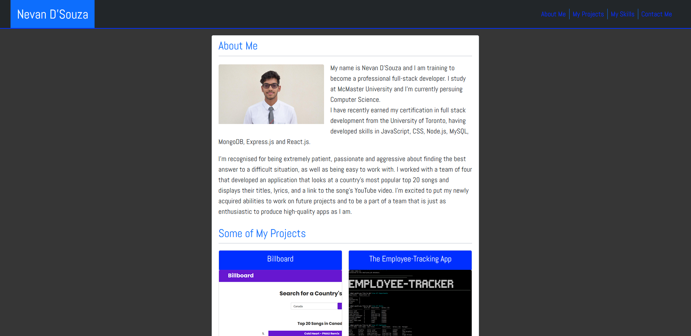
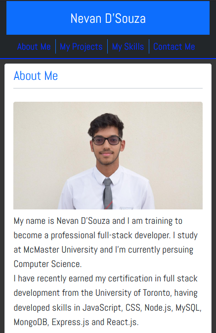

# portfolio-v2

## Description

A new and improved portfolio for myself! My previous one was not up to quality, and was not responsive. 

> Github Repository Link: [https://github.com/nevan-dsouza/portfolio-v2](https://github.com/nevan-dsouza/portfolio-v2)
>
> Deployed Link: [https://nevan-dsouza.github.io/portfolio-v2/](https://nevan-dsouza.github.io/portfolio-v2/)

## Table of Contents

1. [Usage](#usage)
2. [License](#license)
3. [Screenshots](#screenshots)
4. [Questions](#questions)

## Usage

Just click on the deployed link and check it out!

## License

This project is under the "Unlicense" license.

## Screenshots

### Monitor:

### Mobile (smallest width possible):

## Questions

My GitHub Page: [nevan-dsouza](https://github.com/nevan-dsouza)